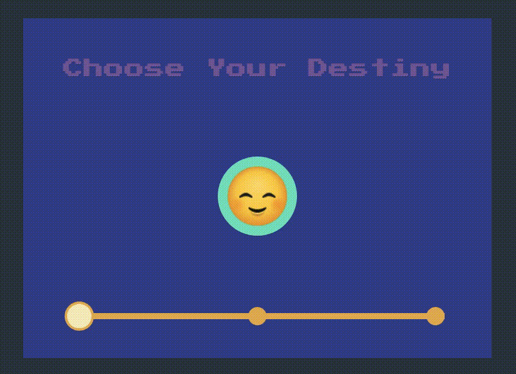

# vanilla_js_difficulty_selector
> :tada: Experimento simples de *FrontEnd* com o objetivo de criar um seletor de dificuldade baseado em JavaScript puro + CSS, usando *tagged template strings* para simular (**de forma MUITO grosseira**) o funcionamento do **ReactJS** + **Styled Components**.

## Gostaria de testar?
[Difficulty Selector](http://siqueira-ec.github.io/vanilla_js_difficulty_selector)

## Pequena Demonstração

